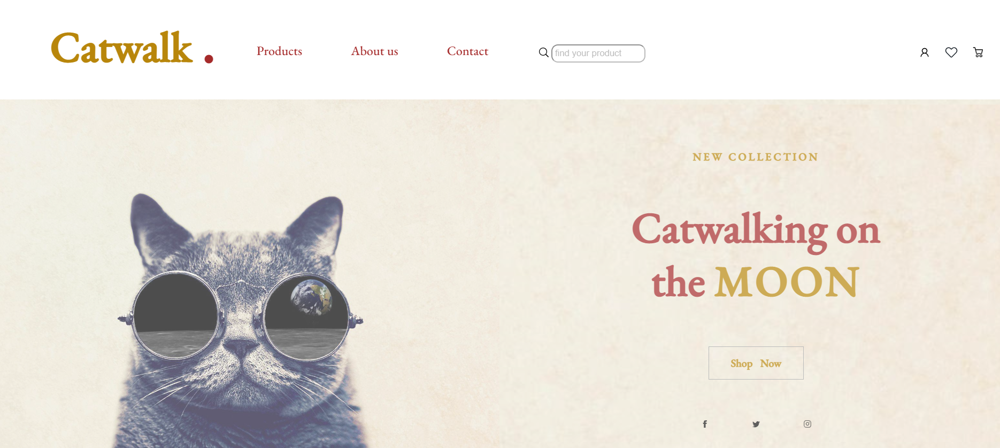

# CATWALK - Fashion Webshop
## Codecademy Challenge Project: Company Home Page with Flexbox

## Table of contents

- [Overview](#overview)
  - [The challenge](#the-challenge)
  - [Screenshot](#screenshot)
  - [Links](#links)
- [My process](#my-process)
  - [Built with](#built-with)
- [Author](#author)

## Overview

### The challenge

-Design and build the layout for a company’s homepage. 

-Use flexbox styling for layout.

### Screenshot

### Links

- [Git hub code](https://github.com/marianarainha/catwalk)
- [Git hub live page](https://marianarainha.github.io/catwalk/)

## My process

### Built with

- Semantic HTML5 markup
- Flexbox

## Author

- Website - [Github](https://github.com/marianarainha)

